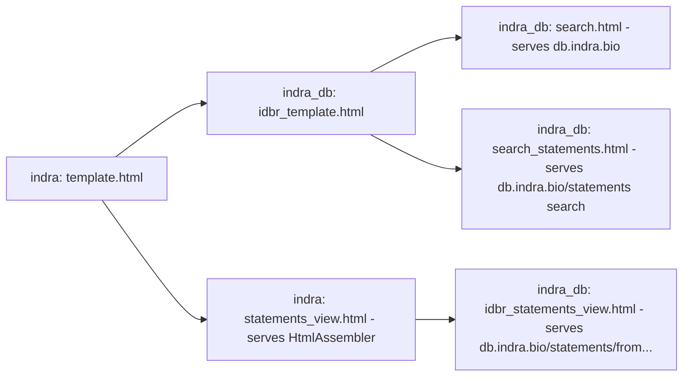

The file template.html in this directory is template base for several files. See
the diagram below for the inheritance structure. If you make changes to
template.html, be sure to check all the files that inherit from it to make sure
they still work as expected.

These files are currently in active use, however there are more files that
inherit from template.html that are not currently in use.
- search.html is the template used for https://db.indra.bio
- search_statements.html is the template used for https://db.indra.bio/statements
- statements_view.html is the template used in the HtmlAssembler class in indra.
- idbr_statements_view.html is the template used for https://db.indra.bio/statements/from...

