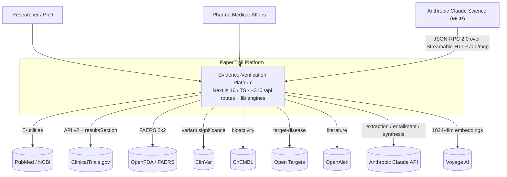
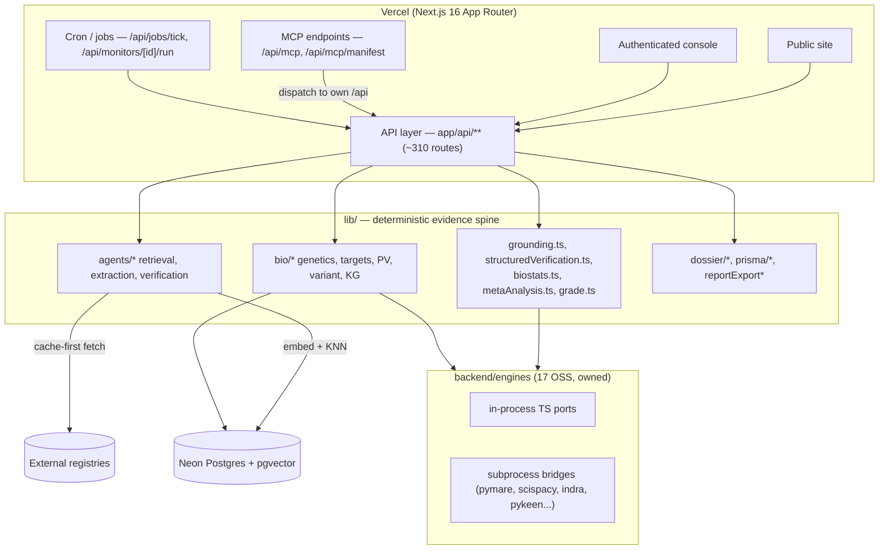
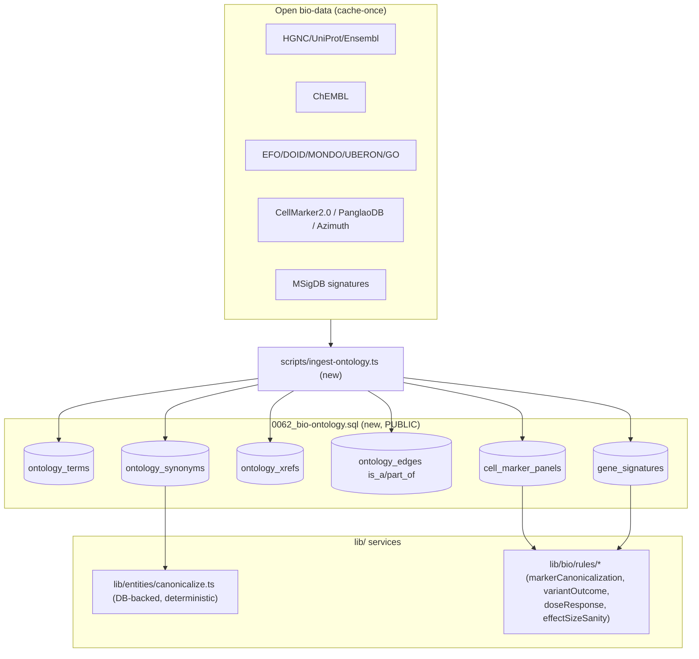

# PaperTrail — Enterprise Architecture

_Produced by three principal-architect passes (`.claude/workflows/enterprise-architecture.js`),
grounded in the live codebase. Companion to [`roadmap-realworld.md`](./roadmap-realworld.md)._

Three views: **(1) System & the evidence spine**, **(2) Enterprise infra / security / scale (incl.
the edge/XDR gateway decision)**, **(3) Biology domain-knowledge layer & bioinformatics-finding
verification.**

---

## 1 · System architecture & the evidence spine

### C4 L1 — System context



Claude & Voyage are used **only** for extraction/entailment/embeddings — never in the numeric loop
(`biostats.ts`, `structuredVerification.ts`). All external evidence is cached in Neon before the
verify hot path.

### C4 L2 — Containers



### The evidence spine — ingest → canonicalize → retrieve/rerank → verify → synthesize → codify

```mermaid
flowchart TD
  A["Claim / passage / document"] --> B{Ingest}
  B -->|cache-first: sources table| C["Canonicalize entities\nPubTator grounding, sourceId parse (DOI/PMID/NCT)"]
  B -->|cold miss + not DEMO_MODE| B2["Live fetch PubMed + CT.gov\nembed (Voyage 1024) + cache"]
  B2 --> C
  C --> D["Retrieve / rerank\npgvector cosine KNN, threshold 0.72, top-3"]
  D -->|0 confident matches| DZ["no_support_found (honest downgrade)"]
  D --> E["Extract structured finding per source (Zod-validated, cached)"]
  E --> F1["LLM lane: entailment / discrepancy\n(discrepancy_type, trust_score, spans)"]
  E --> F2["Numeric lane (NO LLM)\nbiostats 2x2 RR+CI, checkAgainstRegistry, effectSize.reconcile"]
  F1 --> G["Ground spans verbatim (drop ungroundable; char offsets)"]
  F2 --> H["Deterministic cross-check verdict"]
  G --> I["Merge: LLM verdict + numeric signals\n(numeric never overrides discrepancy_type)"]
  H --> I
  I --> J{Synthesize (>= 2 poolable sources)}
  J -->|yes| K["metaAnalysis (fixed+random, I2, tau2) + GRADE + PyMARE cross-check"]
  J -->|no| L["single-source verdict"]
  K --> M["Codify: PRISMA/SoF, provenance chain, evidence_reports, export"]
  L --> M
  I --> N["Persist verification (best-effort) + audit-chain hash link"]
  M --> N
```

---

## 2 · Enterprise infra, security, scale — and the XDR/Envoy decision

### 🎯 Decision: **BUILD the gateway in TypeScript — do NOT fork Envoy**

You asked about an Envoy fork / XDR control plane like Atlassian's. The architect verdict is
**build, don't fork**, and here's why it's the right call for us:

- The differentiating gateway logic — **hashed per-org API keys, `checkQuota` billing enforcement,
  RLS org binding, WORM provenance** — already lives in TypeScript in `lib/apiv1/gateway.ts`,
  co-located with Neon. An Envoy fork re-implements all of that in a second language and **splits
  the audit trail** (the one thing we can't fragment).
- **Instead:** consolidate the scattered front door (`middleware.ts` + `lib/rateLimit` + `lib/apiv1/gateway.ts`)
  into **one ordered TS chain**: WAF → IP-allowlist → authN (session | hashed api_keys | SSO) →
  authZ (`rbac.ts` + permission_grants) → RLS bind (`SET app.current_org_id`) → rateLimit +
  checkQuota → provenance stamp. Wrap **all** mutating routes (today ~300 non-v1 routes lack uniform
  auth/quota). Add **Vercel WAF/BotID** at the edge.
- **The honest "XDR":** a tenant-scoped **threat-detection cron** over telemetry we already own
  (`api_requests`, `rate_limit_events`, `error_events`) — flags key-from-new-IP, quota-exhaustion
  spikes, 401/403 bursts, cross-tenant probes → `audit_chain` for regulated tenants. No bolted-on SIEM.
- **Reserve Envoy** only for a future 1M+ user Cloud Run microservices split.

### Identity, SSO/SCIM & tenant isolation

```mermaid
sequenceDiagram
  participant IdP as Enterprise IdP (SAML/OIDC)
  participant SCIM as SCIM 2.0
  participant GW as Control Plane (gateway)
  participant APP as Route handler
  participant DB as Neon (RLS + audit_chain)
  IdP->>SCIM: Provision user (bearer token, hashed)
  SCIM->>DB: Upsert users + org membership
  IdP->>GW: SSO login (domain-verified)
  GW->>GW: Resolve org SERVER-SIDE; load role (rbac.ts)
  GW->>DB: SET app.current_org_id = org (RLS bind)
  GW->>GW: checkQuota + rateLimit + ip_allowlist
  GW->>APP: Forward ApiCtx {orgId, role, requestId}
  APP->>DB: Org-scoped query (RLS backstop enforces)
  APP->>DB: writeAudit + appendToChain (WORM)
```

**Tenant isolation in depth:** explicit `org_id` WHERE clauses **+** an RLS backstop via the
`app.current_org_id` GUC, so a forgotten WHERE clause cannot leak cross-tenant rows. Org id is
always resolved server-side — never client-asserted.

### Scale-out plan

- **Read/write split + regional read replicas (US/EU)** for the read-heavy verify/search/report
  path; keep the **append-only `audit_chain`, signatures, usage writes on the Neon primary** to
  preserve the single-writer invariant the WORM chain's per-org advisory lock depends on. EU replica
  → data residency for HIPAA/GDPR pharma buyers.
- **Durable queue + dedicated worker tier** (SQS/Cloud Tasks + Cloud Run) for multi-source ingest,
  PyKEEN nightly KG training, and audit-PDF/PRISMA export. Keep the `jobs` table as the org-scoped
  control surface. Required before the roadmap's ingest + learned link-prediction can run.
- **Object storage** (S3/GCS, content-addressed by hash) for source snapshots, chain-of-custody
  PDFs, and PRISMA/SoF DOCX — keeps Postgres lean, makes snapshot versioning cheap.

### Compliance (controls already have owning modules — the work is operationalizing them)

| Framework | Backed by | Gap to close |
|---|---|---|
| **SOC 2** | RBAC (`rbac.ts`) + permission_grants, hashed `api_keys`, `audit_log`, observability | access-review job, CI log-scrubbing check |
| **HIPAA** | RLS + IP-allowlist tenant isolation, SSO/SCIM/MFA, "no PHI/keys in logs" | BAA with Anthropic/Neon, encryption-at-rest attestation |
| **21 CFR Part 11 / GxP** | `esign.ts` e-signatures, WORM `audit_chain` (`chain.ts`), `retention.ts` | retention purge worker, nightly `verifyChain()` integrity alarm |

### Packaging → **Researcher / Team / Pharma-Enterprise**

Gate the **regulatory moat as Enterprise-only**: Part 11 e-signatures, immutable audit-chain export,
SSO/SCIM/MFA, IP-allowlist, EU read-replica residency, dedicated worker throughput, BAA — enforced
through the existing `plans` + `checkQuota` + feature-flags stack. That aligns the defensible
differentiator with the highest-value buyer.

---

## 3 · Biology domain-knowledge layer & bioinformatics-finding verification

**Our lane:** Claude Science *runs* scanpy/phylogenetics and *produces* claims ("CD8 memory/exhausted
ratio stratifies ICB responders, AUC 0.86; signature IL7R/TCF7/CCR7"). **PaperTrail verifies them** —
deterministically, grounded, with provenance — against curated ground truth Claude Science doesn't have.

### Domain knowledge layer



### Verify-a-bioinformatics-finding — deterministic flow

```mermaid
flowchart TD
  IN["Structured finding\nassertion + markerGenes[] + cellType\n+ effectSize{AUC/HR/logFC, CI} + population + sourceText"] --> API["POST /api/bio/verify-finding (new)"]
  API --> VF["lib/bio/verifyBioinformaticsFinding.ts\n(sibling of verifyBiomedicalClaim.ts)"]
  VF --> CAN["canonicalize markers+cellType -> CURIE"]
  VF --> GRD["ground effect-size number verbatim (locateSpan)"]
  CAN --> MC["markerCanonicalizationCheck vs cell_marker_panels"]
  CAN --> BM["validateBiomarker() (reuse) per marker"]
  GRD --> ES["effectSizeSanity + populationMismatch (AUC in [0.5,1], CI vs point)"]
  CAN --> VO["variantOutcomeConsistency vs ClinVar (reuse)"]
  MC --> SIG{{Signal: positive|overstated|negative|empty}}
  BM --> SIG
  ES --> SIG
  VO --> SIG
  SIG --> ROLL["combineFindingVerdict() — PURE"]
  ROLL --> OUT["verdict + flagged_spans (exact offsets) + per-marker canonicalization"]
```

### Build plan (all deterministic — no LLM in linking or the verdict path)

1. **`0062_bio-ontology.sql`** — `ontology_terms/synonyms/xrefs/edges` (HGNC, UniProt, ChEMBL,
   EFO/DOID/MONDO, GO, UBERON, MeSH, UMLS) + `cell_marker_panels` + `gene_signatures`. Public,
   non-org-scoped (the `bio_cache`/`kg_nodes` precedent). `kg_nodes.normalized_id` becomes a CURIE FK.
2. **`scripts/ingest-ontology.ts`** — seed from CellMarker 2.0 / PanglaoDB / MSigDB / Azimuth (cache-once).
3. **`lib/entities/canonicalize.ts` + `lib/bio/ontology.ts`** — DB-backed resolver replacing the
   ~30-concept in-code dictionary; keeps the scispaCy-port contract (exact=1.0, fuzzy>threshold,
   type-consistent, null below `LINK_THRESHOLD`), **still deterministic**.
4. **`lib/bio/verifyBioinformaticsFinding.ts` + `POST /api/bio/verify-finding`** — sibling of
   `verifyBiomedicalClaim.ts`; grounds every claimed AUC/HR/logFC to an exact source substring, drops
   ungroundable numbers, flags overstatement + population mismatch + non-canonical markers.
5. **`lib/bio/rules/*.ts`** — 4 pure modules: `markerCanonicalization`, `variantOutcomeConsistency`,
   `doseResponseSanity`, `effectSizeSanity`.
6. **Skills + MCP tools** — `papertrail-verify-bioinformatics-finding`, `papertrail-marker-check`,
   `papertrail-canonicalize-entity`; `mcp/src/tools/bioDomain.ts` with `verify_bioinformatics_finding`,
   `check_marker_panel`, `canonicalize_entity`, `verify_variant_outcome`.
7. **UI** — `/console/bio/finding` (paste a finding → per-check verdict cards + grounded span
   highlight) and an `/console/ontology` term explorer.

**Why it's the differentiator:** marker/signature **ground truth** (CellMarker/PanglaoDB/Azimuth with
direction + tissue + PMID) is curated data an LLM-analysis tool doesn't have — deterministic,
auditable, regulatory-grade.
