# PaperTrail — OSS Engine Architecture & Claude Usage

How each of the 17 vendored OSS engines is used in the product, and **exactly where the Claude API
runs vs. where the path is deterministic**. Every engine has a PaperTrail-native `papertrail_*.py`
under `backend/engines/<engine>/`, a native TypeScript module in `lib/`, and an `app/api` route.

> **The moat rule, visible in every diagram:** Claude is used **only** for a language step
> (extraction / judgment / tagging / prose), and its output is always **grounded** (every quoted
> span must be a verbatim substring of the source, or it is dropped). **No LLM is ever in a
> numeric / verdict / scoring path** — those are deterministic and reproducible. That separation is
> what produces the fair-benchmark result (PaperTrail 95% vs Claude-alone 75% on efficacy-magnitude
> claims): the deterministic recompute catches subtle distortions a fluent LLM waves through.

## Claude-usage map

| Engine | Route | Claude step | Runs with Claude | Deterministic core |
|---|---|---|:--:|---|
| MiniCheck | `/api/verify/absence-claim` | presence/absence judgment | ✅ default | polarity detection, label table, grounding |
| Valsci | `/api/verify/contradiction-resolve` | design-feature tagging | ✅ default | side partition, dimension scoring, resolution |
| INDRA | `/api/mechanism` | causal-statement extraction | ✅ default | dedup, belief combination, KG upsert |
| scispaCy | `/api/entities` | NER mention proposal | ✅ default | Schwartz-Hearst, grounding, KB linking |
| Loki / OpenFactVerification | `/api/retrieval/rerank` | on-topic relevance tag | ✅ **now default** | claim-frame extraction + overlap ranking |
| STORM | `/api/synthesis/debate` | connective prose only | ✅ default | evidence ranking, stance, grounding |
| MultiVerS | `/api/scieval/aggregate` | — (labels assigned upstream) | deterministic | confidence-weighted tally + classification |
| paper-qa | `/api/sources/quality-tier` | — | deterministic | tier rubric + weight (retracted → 0) |
| R2R | `/api/retrieval/hybrid` | — | deterministic | facet decomposition + RRF fusion |
| open_deep_research | `/api/deep-research/iterative` | — | deterministic | sufficiency gate + widen loop (capped) |
| PyKEEN | `/api/kg/predict/learned` | — | deterministic | TransE embeddings (fixed seed) |
| BioCypher | `/api/kg/import` | — | deterministic | Biolink domain/range validation |
| pyalex | living-evidence monitor | — | deterministic | OpenAlex citation velocity |
| pytrials | `/api/trials/design` | — | deterministic | eligibility parse + design credibility |
| ASReview | `/api/screening/ensemble` | — | deterministic | TF-IDF + 3-head Naive Bayes ensemble |
| PyMARE | `/api/meta/bayesian`, `/api/meta/sensitivity` | — | deterministic | closed-form Bayesian + leave-one-out |
| FAERS / ClinVar / ChEMBL | ingest → `/api/ingest/multi-source` | — | deterministic | live fetch → normalize → cache-once |

Legend: **red** node = Claude step · **blue** = deterministic · **green** = grounding gate.

---

## Verification engines

### MiniCheck — negation-aware absence-claim verification

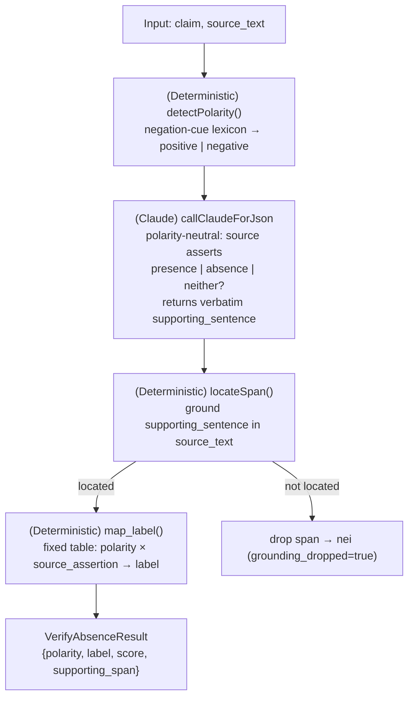

### MultiVerS — cross-source label aggregation

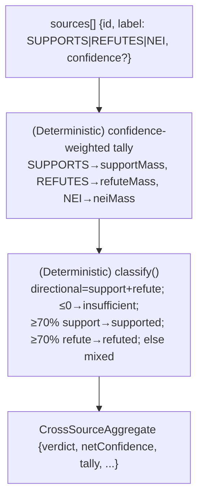

### Valsci — quantitative contradiction atlas

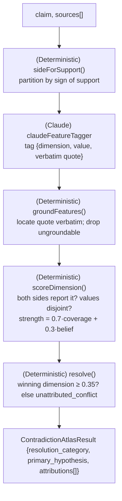

### Loki / OpenFactVerification — claim-frame reranker

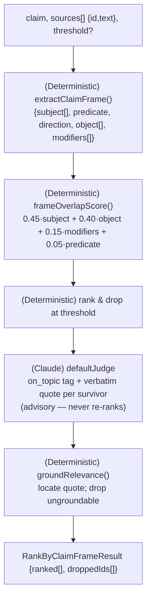

---

## Retrieval & research engines

### paper-qa — source-quality tiers

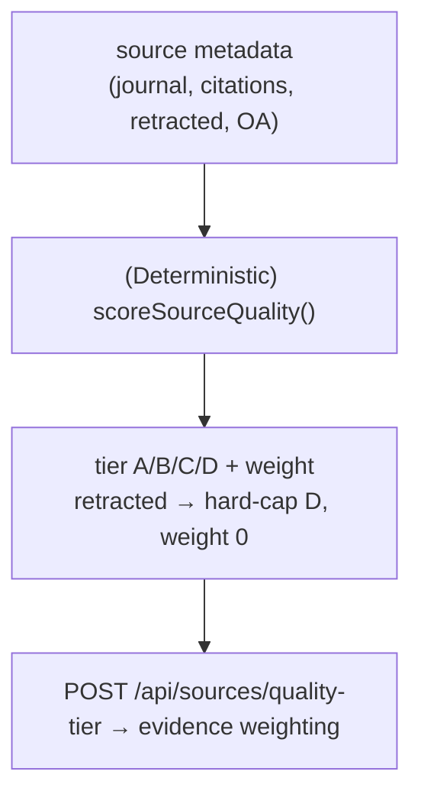

### R2R — RAG-fusion faceted retrieval

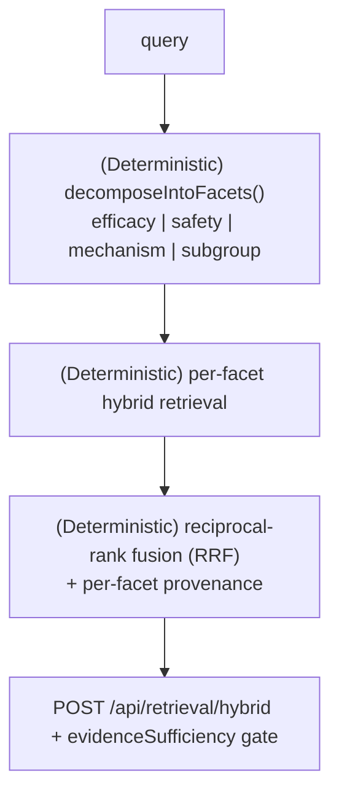

### STORM — structured debate for mixed verdicts

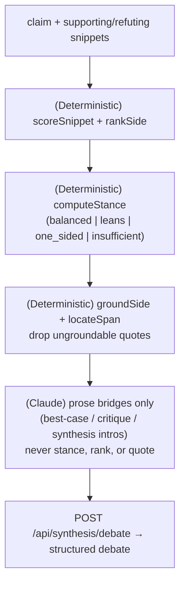

### open_deep_research — iterative sufficiency loop

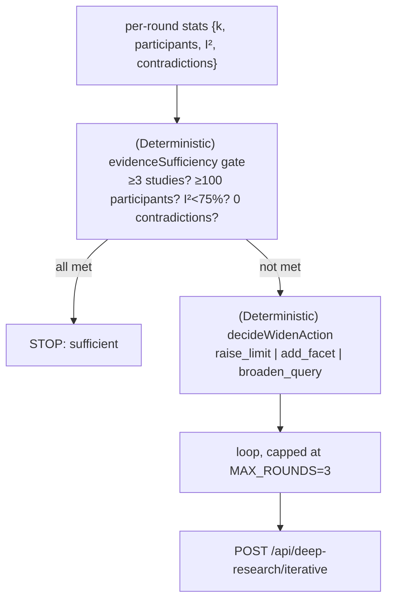

---

## Biomedical KG & NLP engines

### INDRA — mechanism assembly

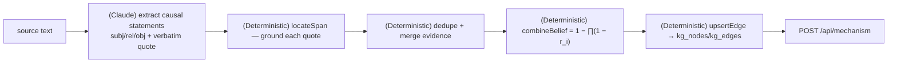

### scispaCy — NER + entity linking

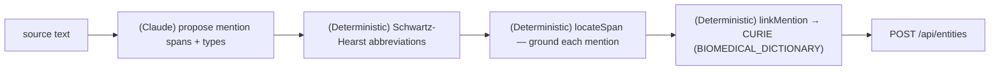

### PyKEEN — learned link prediction

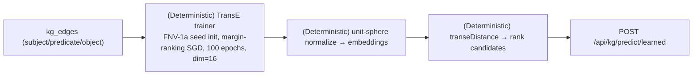

### BioCypher — bring-your-own-KG import

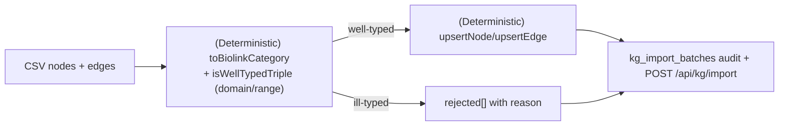

---

## Sources, screening & meta engines

### pyalex — citation velocity (living-evidence signal)

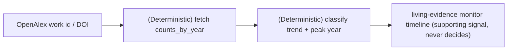

### pytrials — eligibility parse + design credibility

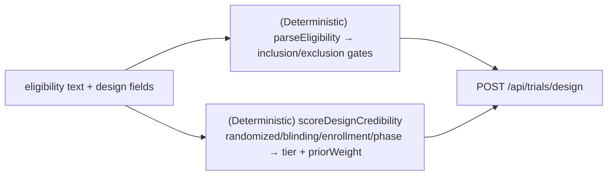

### ASReview — ensemble screening

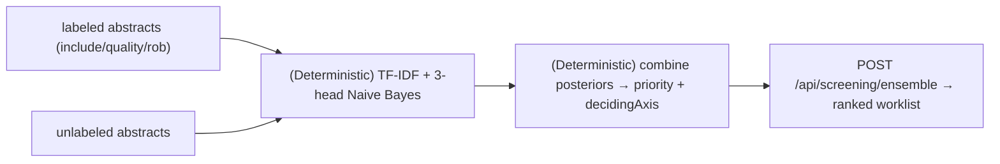

### PyMARE — Bayesian + sensitivity meta

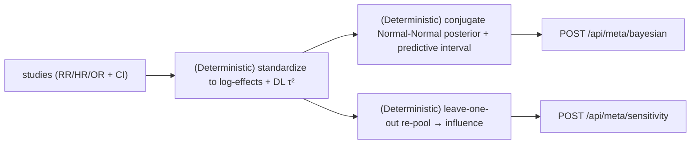

### FAERS / ClinVar / ChEMBL — evidence-integrator ingest

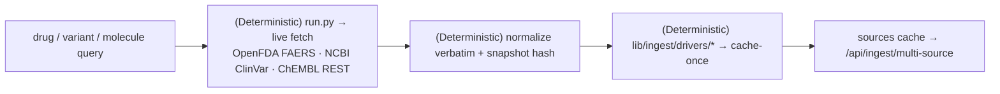

---

## "Run with Claude at full capacity"

Five engines call Claude by default (MiniCheck, Valsci, INDRA, scispaCy, STORM). The **Loki
reranker** was Claude-capable but off — its grounded relevance pass is now enabled by default on
`/api/retrieval/rerank` (pass `llm: false` for the pure deterministic ranking). The remaining
engines are deterministic **by design**: their outputs are numbers/verdicts that must be reproducible and
audit-defensible — putting an LLM in that path is exactly what PaperTrail refuses to do, and is why
it beats a plain LLM on the fair benchmark. Where a natural-language explanation of a deterministic
result is useful, an **optional grounded Claude explanation layer** can be added per route without
touching the numeric core (the same pattern the bio engines already use via `summarize`).
